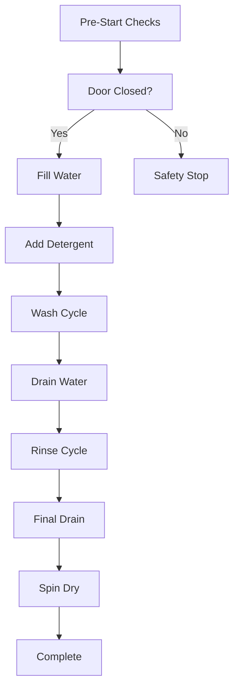

# 🌊 Embedded Water Management Systems

> **Advanced Arduino & Embedded Control Systems for Water Management Applications**

[](https://opensource.org/licenses/MIT)
[](https://www.arduino.cc/)
[](https://en.wikipedia.org/wiki/Solar_power)
[]()
[](https://peppy-longma-3e4c41.netlify.app/)
[](https://www.youtube.com/playlist?list=PLrZbkNpNVSww3QIStzPcdd2qOiZF5aa6b)

---

## 🔗 **Quick Links**

- 🌐 **Live Website**: [https://peppy-longma-3e4c41.netlify.app/](https://peppy-longma-3e4c41.netlify.app/)
- 📺 **YouTube Channel**: [Solar & Washing Machine Engineering](https://www.youtube.com/playlist?list=PLrZbkNpNVSww3QIStzPcdd2qOiZF5aa6b)
- 📧 **Contact**: [hhnk3693@gmail.com](mailto:hhnk3693@gmail.com)
- 💻 **GitHub**: [HorizonHnk](https://github.com/HorizonHnk)

---

## 📖 **Project Overview**

This repository contains comprehensive embedded systems projects for **water management applications**, featuring both **Arduino-based solar systems** and **industrial washing machine controllers**. The projects demonstrate real-world applications of microcontroller programming, sensor integration, and automated control systems.

### 🌐 **Live Documentation & Demos**

- **Professional Website**: Complete project documentation, technical specifications, and visual demonstrations available at [https://peppy-longma-3e4c41.netlify.app/](https://peppy-longma-3e4c41.netlify.app/)
- **Video Tutorials**: In-depth technical explanations and build demonstrations on our [YouTube Channel](https://www.youtube.com/playlist?list=PLrZbkNpNVSww3QIStzPcdd2qOiZF5aa6b)
- **Interactive Demos**: System architecture diagrams and component explanations

### **Key Features**

- ☀️ **Solar-powered autonomous operation**
- 📱 **Remote control via IR communication** 
- 🖥️ **Real-time LCD status display**
- ⚡ **Motor control with PWM and H-bridge drivers**
- 🛡️ **Safety interlocks and protection circuits**
- 🔄 **Bidirectional pump and motor control**
- 📊 **Sensor-based feedback systems**
- 🌐 **Professional website documentation**
- 📺 **YouTube video tutorials and demonstrations**

---

## 📁 **Repository Structure**

```
📦 Embedded-Water-Management-Systems/
├── 📂 arduino-solar-system/          # Solar-powered water management
│   ├── 📂 src/                       # Arduino source code
│   ├── 📂 schematics/                # Circuit diagrams
│   ├── 📂 docs/                      # Documentation
│   └── 📄 README.md                  # Project-specific docs
├── 📂 washing-machine-controller/     # Industrial washing system
│   ├── 📂 firmware/                  # Embedded firmware
│   ├── 📂 hardware/                  # PCB designs & schematics
│   ├── 📂 docs/                      # Technical documentation
│   └── 📄 README.md                  # Project-specific docs
├── 📂 shared-libraries/              # Common libraries
├── 📂 tools/                         # Development tools
├── 📂 examples/                      # Code examples
├── 📄 LICENSE                        # MIT License
├── 📄 CONTRIBUTING.md               # Contribution guidelines
└── 📄 README.md                     # This file
```

---

## 🚀 **Quick Start**

### **🌐 Explore Online First**

Before diving into the code, check out our comprehensive online resources:

1. **Visit the Website**: [https://peppy-longma-3e4c41.netlify.app/](https://peppy-longma-3e4c41.netlify.app/)
   - View detailed system architecture diagrams
   - Understand component interactions
   - See technical specifications

2. **Watch Tutorial Videos**: [YouTube Channel](https://www.youtube.com/playlist?list=PLrZbkNpNVSww3QIStzPcdd2qOiZF5aa6b)
   - Solar system build walkthroughs
   - Washing machine controller explanations
   - Component-specific tutorials

### **Prerequisites**

```bash
# Required Software
- Arduino IDE (v2.0+)
- PlatformIO (optional, recommended)
- Git

# Required Hardware
- Arduino Uno/Nano
- Solar panel (12V, 10-50W)
- L298N Motor Driver
- TIP120 Transistor
- IR Sensor Module
- LCD Display (16x2 with I2C)
```

### **Installation**

```bash
# Clone the repository
git clone https://github.com/HorizonHnk/Embedded-Water-Management-Systems.git
cd Embedded-Water-Management-Systems

# Install dependencies
# (Instructions for each project in respective README files)
```

---

## 🔧 **Project 1: Solar-Powered Arduino Water System**

> **Autonomous water management with renewable energy**

### **System Components**

| Component | Function | Specs |
|-----------|----------|-------|
| 🔋 **PV Solar Panel** | Renewable power source | 12V, 10-50W |
| 🧠 **Arduino Uno** | Central processing unit | ATmega328P, 16MHz |
| 🎛️ **Start/Stop Button** | Emergency control | Momentary push, NC |
| 💡 **Status LED** | Visual feedback | 5mm LED + 220Ω resistor |
| 👁️ **IR Sensor** | Level detection & remote RX | 2-30cm range, digital out |
| ⚡ **TIP120 Transistor** | High-current switching | 5A max, Darlington NPN |
| 🌊 **Drain Pump** | Water removal | 12V DC, 3-5A |
| 🔄 **DC Motor** | Mechanical drive | 12V, PWM speed control |
| 🔧 **Solenoid Valve** | Flow control | 12V, NC type |
| 🔌 **Relay Module** | AC switching & isolation | 10A @ 250VAC |
| 📺 **I2C LCD** | Status display | 16x2 char, green backlight |
| 📱 **Remote Control** | Wireless operation | IR protocol, 5-10m range |

### **Circuit Overview**

```
PV Solar ──→ Arduino VIN ──→ System Power
    │
    ├──→ TIP120 ──→ Drain Pump
    ├──→ L298N ──→ DC Motor
    ├──→ Relay ──→ Solenoid Valve
    ├──→ LCD Display (I2C)
    ├──→ IR Sensor
    └──→ Control Buttons & LEDs
```

### **Key Features**

- ✅ **Autonomous Operation**: Solar-powered with battery backup
- ✅ **Remote Control**: IR remote for wireless operation
- ✅ **Safety Systems**: Emergency stop, overcurrent protection
- ✅ **Real-time Monitoring**: LCD display with system status
- ✅ **Variable Speed Control**: PWM motor control
- ✅ **Multiple Sensors**: Water level, IR proximity detection

---

## 🏭 **Project 2: Washing Machine Controller**

> **Industrial-grade washing machine embedded control system**

### **System Architecture**

#### **Multi-View Component Layout**

| View | Key Components | Function |
|------|----------------|----------|
| **Front** | Door, Control Panel, IR Sensor | User interface & safety |
| **Back** | Water Inlet, Power Supply | Utility connections |
| **Internal** | Drum, Motor, Pump System | Core washing mechanics |
| **Bottom** | Drain Pump, Motor Assembly | Water management |

### **Core Components**

#### **🚿 Water Management System**
- **Soap Inlet**: Automated detergent dispensing
- **Water Inlet Valve**: Dual solenoid (hot/cold)
- **Drain Pump**: High-flow centrifugal pump
- **Water Level Sensors**: Capacitive/pressure sensing

#### **⚙️ Mechanical Drive System**
- **DC Motor**: Variable speed, high torque
- **Drum Assembly**: Stainless steel, perforated
- **Drive Mechanism**: Belt/direct drive options
- **Motor Rotation**: Bidirectional control

#### **🛡️ Safety & Control**
- **IR Sensor**: Door interlock system
- **Power Supply**: Regulated DC conversion
- **Emergency Stop**: Immediate shutdown capability
- **Protection Circuits**: Overcurrent, thermal protection

### **Operating Phases**



---

## 📊 **Technical Specifications**

### **Arduino Solar System**

| Parameter | Specification | Notes |
|-----------|---------------|-------|
| **Operating Voltage** | 7-12V DC | Solar panel input |
| **Current Consumption** | 200mA - 8A | Varies with load |
| **Communication** | I2C, IR, Digital I/O | Multiple protocols |
| **Operating Temperature** | -20°C to +70°C | Industrial range |
| **Protection Rating** | IP54 (with enclosure) | Dust/water resistant |

### **Washing Machine Controller**

| Parameter | Specification | Notes |
|-----------|---------------|-------|
| **Power Supply** | 110-240V AC | Universal input |
| **Motor Control** | 500W - 2kW | Variable load |
| **Water Pressure** | 20-80 PSI | Standard plumbing |
| **Cycle Time** | 30-120 minutes | Programmable |
| **Safety Compliance** | CE, UL, FCC | International standards |

---

## 💻 **Code Examples**

### **Arduino Main Loop**

```cpp
void loop() {
    // Read sensors
    waterLevel = analogRead(WATER_LEVEL_PIN);
    irDistance = digitalRead(IR_SENSOR_PIN);
    
    // Process remote commands
    if (irReceiver.decode(&results)) {
        processRemoteCommand(results.value);
        irReceiver.resume();
    }
    
    // Control pumps based on logic
    if (waterLevel < LOW_THRESHOLD && !emergencyStop) {
        digitalWrite(PUMP_RELAY, HIGH);
        pwmControl(DRAIN_PUMP_PIN, pumpSpeed);
    }
    
    // Update display
    updateLCDDisplay();
    
    delay(100); // 10Hz update rate
}
```

### **Motor Control Function**

```cpp
void controlMotor(int speed, bool direction) {
    // Safety check
    if (!digitalRead(EMERGENCY_STOP_PIN)) {
        stopAllMotors();
        return;
    }
    
    // Set direction
    digitalWrite(MOTOR_DIR1, direction);
    digitalWrite(MOTOR_DIR2, !direction);
    
    // Set speed (0-255 PWM)
    analogWrite(MOTOR_PWM_PIN, speed);
    
    // Update status LED
    digitalWrite(STATUS_LED, speed > 0);
}
```

---

## 📋 **Installation Guide**

### **Step 1: Hardware Assembly**

1. **Mount Arduino** in weatherproof enclosure
2. **Connect solar panel** via charge controller
3. **Wire sensors** according to schematic
4. **Install pumps** and motor drivers
5. **Test all connections** before powering on

### **Step 2: Software Setup**

```bash
# Clone repository
git clone https://github.com/HorizonHnk/Embedded-Water-Management-Systems.git

# Open in Arduino IDE
arduino arduino-solar-system/src/main.ino

# Install required libraries
# - LiquidCrystal_I2C
# - IRremote
# - NewPing (if using ultrasonic)

# Upload to Arduino
```

### **Step 3: Configuration**

1. **Calibrate sensors** using provided calibration sketch
2. **Set water level thresholds** in configuration file
3. **Program IR remote codes** for your specific remote
4. **Test safety features** before deployment

---

## 🔍 **Troubleshooting**

### **Common Issues**

| Problem | Symptoms | Solution |
|---------|----------|----------|
| **No power** | System unresponsive | Check solar panel, battery voltage |
| **Pump not starting** | No water flow | Verify TIP120 wiring, check fuse |
| **Remote not working** | IR commands ignored | Check IR sensor connection, battery |
| **Erratic readings** | Sensor values jumping | Add filtering capacitors, check grounds |
| **Motor stalling** | Overheating, slow operation | Check voltage supply, reduce load |

### **Debug Mode**

```cpp
// Enable debug output
#define DEBUG_MODE 1

void debugPrint(String message) {
    #if DEBUG_MODE
    Serial.println("[DEBUG] " + message);
    #endif
}
```

---

## 🤝 **Contributing**

We welcome contributions! Please read our [Contributing Guidelines](CONTRIBUTING.md) before submitting.

### **Development Workflow**

1. **Fork** the repository
2. **Create** a feature branch (`git checkout -b feature/amazing-feature`)
3. **Commit** changes (`git commit -m 'Add amazing feature'`)
4. **Push** to branch (`git push origin feature/amazing-feature`)
5. **Open** a Pull Request

### **Code Standards**

- Use **descriptive variable names**
- **Comment** complex logic
- Follow **Arduino style guidelines**
- **Test** on hardware before submitting

---

## 📄 **License**

This project is licensed under the **MIT License** - see the [LICENSE](LICENSE) file for details.

```
MIT License

Copyright (c) 2025 HorizonHnk - Embedded Water Management Systems

Permission is hereby granted, free of charge, to any person obtaining a copy
of this software and associated documentation files...
```

---

## 🎓 **Additional Resources**

### **📚 Complete Documentation**
Visit our [professional website](https://peppy-longma-3e4c41.netlify.app/) for:
- Interactive system architecture diagrams
- Detailed component specifications
- Visual project galleries
- Professional contact information
- Technical implementation guides

### **🎬 Video Content**
Subscribe to our [YouTube Channel](https://www.youtube.com/playlist?list=PLrZbkNpNVSww3QIStzPcdd2qOiZF5aa6b) for:
- Step-by-step build tutorials
- Component deep-dive explanations
- Troubleshooting guides
- Real-world deployment demonstrations
- Professional engineering insights

### **💼 Professional Services**
For source code access, technical consultation, or custom development:
- **Email**: [hhnk3693@gmail.com](mailto:hhnk3693@gmail.com)
- **Available Services**: Custom project development, technical consultation, educational collaboration

---

## 🙏 **Acknowledgments**

- **Arduino Community** for excellent hardware platform
- **Open Source Libraries** used in this project
- **Contributors** who helped improve the code
- **Solar Power Community** for renewable energy inspiration

---

## 📞 **Support & Contact**

- 📧 **Email**: [hhnk3693@gmail.com](mailto:hhnk3693@gmail.com)
- 🐛 **Issues**: [GitHub Issues](https://github.com/HorizonHnk/Embedded-Water-Management-Systems/issues)
- 🌐 **Website**: [https://peppy-longma-3e4c41.netlify.app/](https://peppy-longma-3e4c41.netlify.app/)
- 📺 **YouTube**: [Solar & Washing Machine Engineering](https://www.youtube.com/playlist?list=PLrZbkNpNVSww3QIStzPcdd2qOiZF5aa6b)

---

## 🏆 **Project Status**

- ✅ **Arduino Solar System**: Production Ready
- ✅ **Professional Website**: Live and Deployed
- ✅ **YouTube Channel**: Active with Technical Content
- 🚧 **Washing Machine Controller**: In Development
- 📋 **Documentation**: 95% Complete
- 🧪 **Testing**: Ongoing

---

## 📈 **Roadmap**

### **Version 2.0 Planned Features**

- [ ] **WiFi connectivity** for remote monitoring
- [ ] **Mobile app** for smartphone control
- [ ] **Data logging** to SD card
- [ ] **Weather API integration** for solar prediction
- [ ] **Machine learning** for optimal scheduling
- [ ] **Multi-language support** for international use

### **Content & Documentation Goals**

- [ ] **Video Tutorial Series**: Complete build walkthroughs for both projects
- [ ] **Interactive Website Features**: Online system configurators and calculators
- [ ] **Technical Blog Posts**: In-depth engineering analysis and case studies
- [ ] **Community Contributions**: Open-source collaboration and user submissions
- [ ] **Educational Partnerships**: University and technical school curriculum integration

### **Long-term Technical Goals**

- [ ] **Commercial-grade** PCB design
- [ ] **IoT platform** integration
- [ ] **Solar tracking** system
- [ ] **Battery management** system
- [ ] **Modular design** for scalability

---

**⭐ Star this repo if you find it useful!**

**🍴 Fork it to contribute!**

**🐛 Report issues to help improve the project!**

**🌐 Visit our [website](https://peppy-longma-3e4c41.netlify.app/) for complete documentation!**

**📺 Subscribe to our [YouTube channel](https://www.youtube.com/playlist?list=PLrZbkNpNVSww3QIStzPcdd2qOiZF5aa6b) for video tutorials!**
